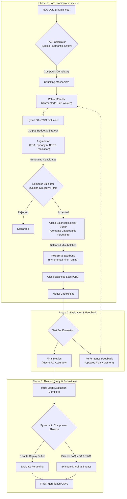
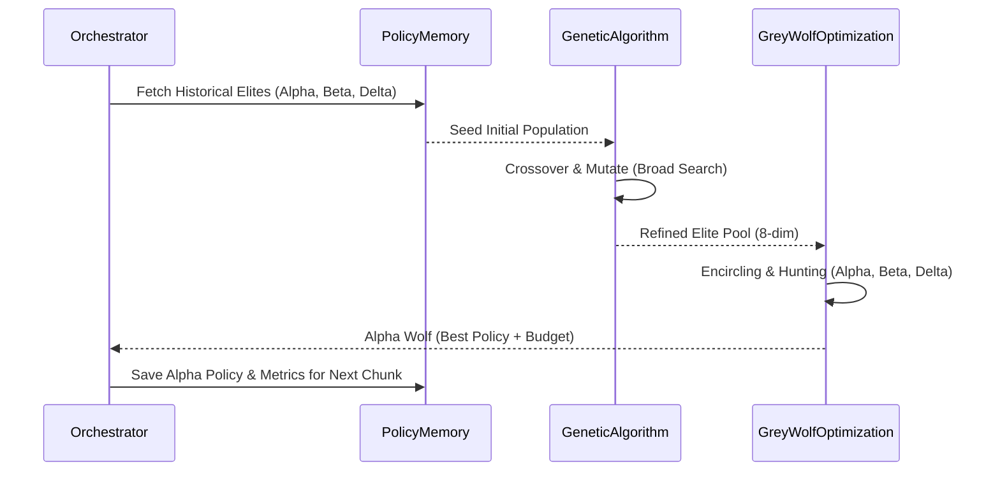

# System Architecture: Hybrid GA-GWO Augmentation Pipeline

This document provides a detailed visual and structural breakdown of the end-to-end incremental natural language processing framework.

## 1. Complete Runtime Pipeline

The entire system is orchestrated to handle imbalanced, low-resource cyber banking text streams by coupling dynamic semantic augmentation with a pre-trained RoBERTa backbone.

---

## 2. Hybrid Optimization Sequence (GA + GWO)

The core novelty of the framework is the union of the **Genetic Algorithm (GA)** for broad exploration and the **Grey Wolf Optimizer (GWO)** for highly targeted local exploitation of the augmentation policy space.

---

## 3. Core Component Descriptions

### **Feature-Aware Complexity Index (FACI)**
A scalar calculation mapping the intrinsic difficulty of an incoming text chunk based on three pillars: Lexical Diversity, Semantic Ambiguity, and Named Entity density. Higher complexity chunks receive tighter augmentation budgets to preserve structural integrity.

### **Policy Memory**
Maintains a historical ledger of top-performing augmentation policies ("Alpha wolves"). When processing a new chunk, it warm-starts the Genetic Algorithm by seeding it with proven policies to prevent the optimizer from converging slowly from scratch.

### **Augmentor & Semantic Validator**
Executes the selected strategy (EDA, Contextual BERT, Back Translation, or Synonym Replacement) based on the assigned budget. It then filters every candidate augmentation using a cosine similarity threshold against a frozen SentenceTransformer embedding to guarantee the underlying financial intent has not been corrupted.

### **Class-Balanced Replay Buffer**
The most structurally critical component for dealing with the `>3:1` class imbalance in the cyber banking dataset. It retains high-quality real and augmented minority class samples across training chunks to prevent the model from suffering catastrophic forgetting during incremental updates.

### **RoBERTa + Class-Balanced Loss (CBL)**
The primary classification engine. RoBERTa is incrementally fine-tuned using Focal Loss and Class-Balanced inverse frequency weighting to heavily penalize misclassifications on minority complaints.
